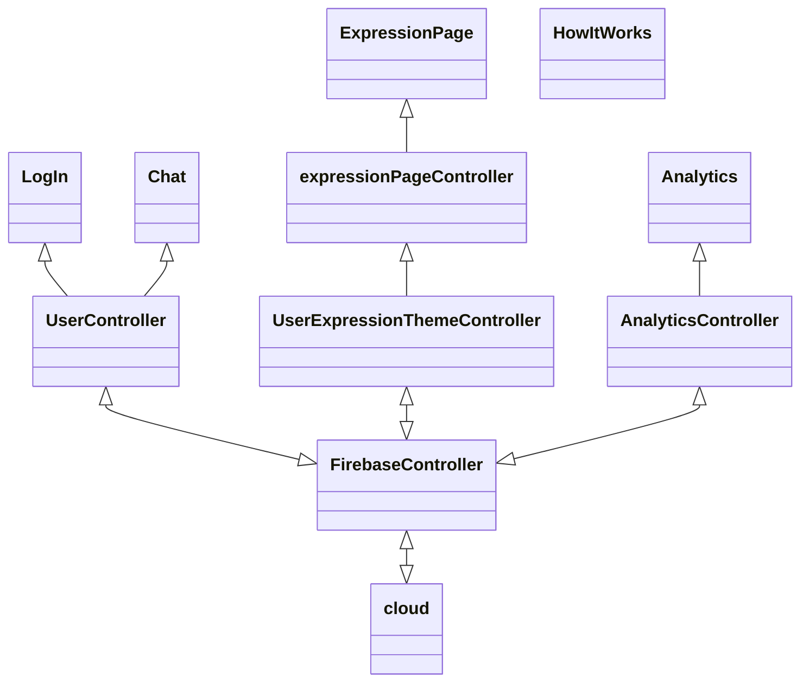
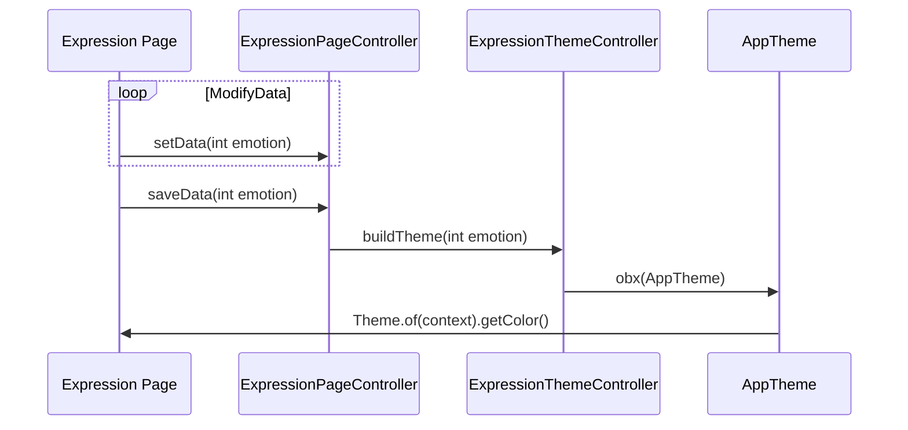
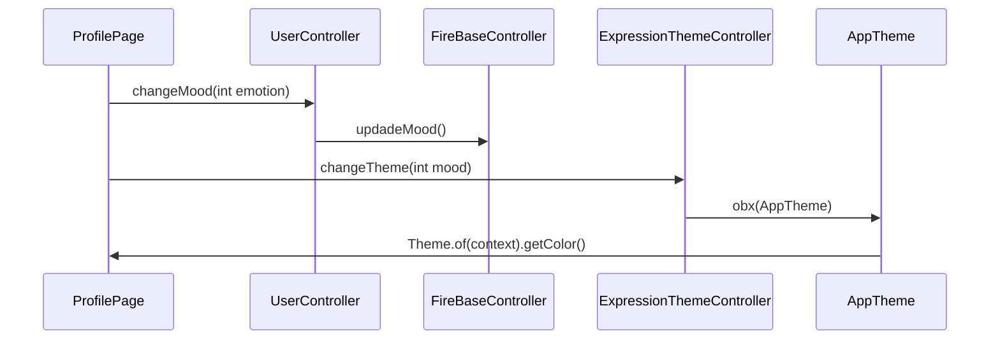
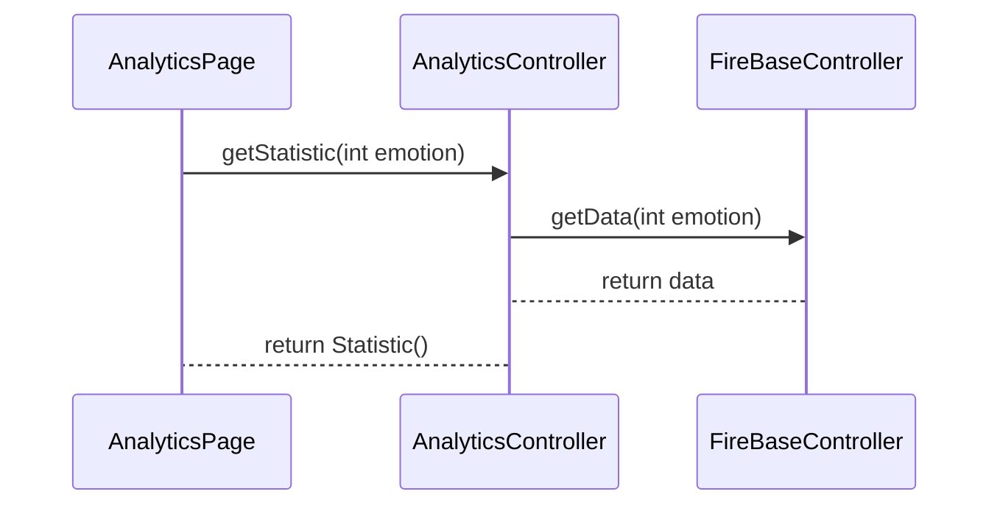

# Estructura de la app

La aplicación esta desarrollada utilizando Flutter ver 2.10.  Flutter es un framework construido encima de dart que permite un alto grado de customización visual a través de la construcción de componentes (widgets). 

Los datos han sido gradados en FireBase a causa de la buena integración que tiene flutter con Firebase. Firebase es una base de datos no relacional que ha permitido modificar el tratado de datos hasta el final del desarrollo. Esto ha permitido muy buena flexibilidad durante el desarrollo. 

## Estructura de la aplicación:

Esta es la estructura simplificada de la app. Para mas detalles acceder al repositorio.

## Diagrama de sequencia caracteristicas

### Crear perfil de Usuario

### Cambiar estado de animo

### Analytics

## Estructura de datos en FireBase

### Estructura usuario

En el caso de usuario solo necsitamos guardar el email, el mood,el url del perfil y un pseudonimo

### UserThemes

En user themes se guarda cada emocion de forma separada.

En cada emocion se guardan los siguientes datos:

### Estructura mensaje

